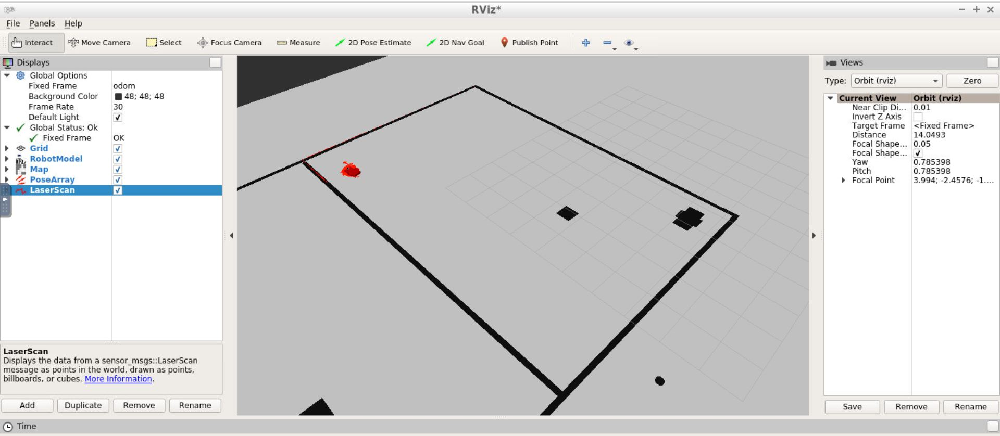
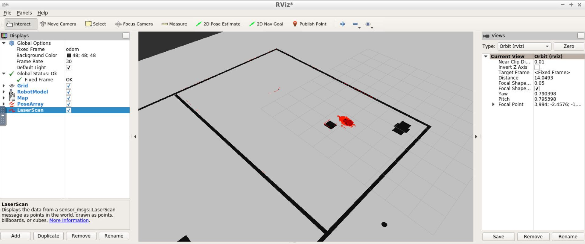
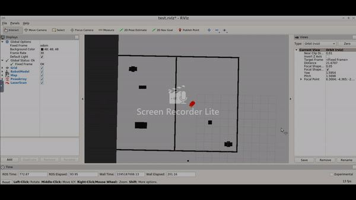

# RoboND-WhereAmI
The objective of this Project is to localize the robot (created in the previous project. Refer to my Go-Chase It udacity Project.) in the map created and test it using amcl node and Rviz.

## AMCL
Localization is performed using amcl(adaptive monte carlo localization) algorithm, where the particles converges to the actual position of the robot as it navigates. The resampling of particles are based on the particle weights so that only the particles very near to the actual position of robot will survive.

## Implementation

This is developed with gazebo workspace. 

## Sensors used:
1. Camera
2. Lidar (Hukoyo)

## launch commands

For launching the world:

		cd /home/workspace/catkin_ws/
		source devel/setup.bash
		roslaunch my_robot world.launch
        
For launching amcl node:

		roslaunch my_robot amcl.launch
        
        
## rvis visualization

 'rvizconfig.rviz' file is used to visualize the localization output 
 
 The screenshots are attached below:
 

